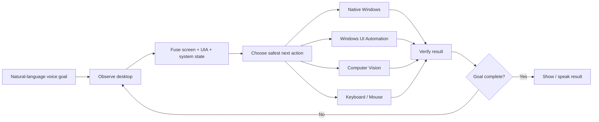

# SHAL Voice PC

> **AI voice control for Windows with computer vision, Windows UI Automation, keyboard/mouse automation, and native system control from an Android phone.**

SHAL Voice PC is an experimental **Windows voice assistant, multimodal desktop automation system, and computer-use agent** designed to control a real Windows PC from natural-language voice commands on Android.

Unlike simple macro tools, SHAL Voice PC is being built around an **observe → understand → act → verify → recover** loop. The agent can inspect what is actually on screen, choose the safest available control method, perform the action, verify the result, and continue toward the user's goal.

## Why this project exists

Most desktop voice assistants are limited to fixed phrases such as “open Chrome” or “turn the volume down.” SHAL Voice PC aims to handle broader goals such as:

> “Open Chrome, go to Gmail, open the newest email from John, summarize it, then go back and open Downloads.”

The system is designed to inspect the desktop after meaningful steps rather than blindly replaying a fixed macro.

## Four control layers

SHAL Voice PC combines four complementary control layers:

| Layer | What it does |
|---|---|
| **Windows UI Automation** | Controls accessible buttons, fields, menus, tabs, lists, toggles, and other normal Windows controls |
| **Vision-based screen control** | Understands visible UI and clicks by screen location when accessibility metadata is missing |
| **Keyboard / mouse automation** | Provides a general fallback for ordinary desktop interaction |
| **Native Windows / system control** | Handles files, processes, services, audio, networking, power, and other OS-level operations |

## Core architecture

## Features

- Natural-language Windows voice commands
- Android remote controller built with Flutter
- FastAPI Windows backend
- Windows UI Automation
- Computer-vision screen understanding
- Vision-guided click / double-click / right-click
- Visual-state waiting and verification
- Keyboard and mouse control
- Window and application control
- File Explorer automation
- Media controls
- Power controls with confirmation
- Live low-bandwidth PC screen on Android
- Touch-to-pointer control
- Piper text-to-speech
- Tailscale private networking
- Confirmation gates for consequential operations
- RustDesk and OpenSSH as independent recovery paths
- Semantic planning through a local model-routing layer
- Ongoing work toward autonomous multi-step desktop control

## Vision-based screen control

The vision layer is designed for cases where Windows accessibility data is incomplete or unavailable.

It can:

- capture the active window or full desktop
- inspect screenshot pixels
- locate a visually described target
- return normalized target coordinates and confidence
- correlate visual targets with UI Automation bounds when available
- click, double-click, or right-click detected targets
- wait for a requested visual state
- verify that the screen changed after an action

This enables control of custom-drawn or unusual desktop interfaces that normal accessibility automation cannot fully inspect.

## Windows UI Automation

The structured UIA layer supports:

- Button invocation
- Edit/Text field input
- CheckBox and toggle state
- ComboBox and List selection
- MenuItem activation
- Tab and ListItem selection
- Focus
- Expand / collapse
- Control-state reading
- Element bounds for screen correlation

## Mobile Android controller

The Flutter app is designed to provide:

- voice input
- assistant status
- spoken responses
- live PC screen
- tap / double-tap / right-click interactions
- safe confirmations
- task interruption
- manual fallback control

## Security model

SHAL Voice PC controls a real computer, so safety is part of the architecture.

- The planner is intended to select from **typed, allowlisted actions**.
- It is **not intentionally given unrestricted model-generated shell access**.
- Consequential operations can require explicit user confirmation.
- The backend is intended to run over a **private Tailscale network**, not direct public Internet exposure.
- Pairing keys, local databases, logs, generated speech, build output, and credentials should remain outside source control.

## Development roadmap

Major work areas include:

- autonomous observe / act / verify task loop
- richer visual reasoning
- browser / DOM-aware control
- typed file-system operations
- clipboard state
- native Windows settings adapters
- interruption and cancellation
- long-running task monitoring
- reliability across different Windows applications
- safer recovery and verification behavior

## Intended use cases

SHAL Voice PC is relevant to developers, researchers, and advanced users interested in:

- Windows voice control
- AI desktop automation
- computer-use agents
- multimodal AI assistants
- computer vision GUI automation
- Windows UI Automation
- Android-to-PC remote control
- local AI assistants
- hands-free computer control
- smart desktop agents
- accessibility automation
- remote Windows automation

## Project status

This repository is under active development. Some features are already implemented and tested, while full universal autonomous control remains a work in progress.

The project intentionally avoids claiming complete control of secure Windows surfaces such as UAC Secure Desktop, the login screen, BIOS/UEFI, or third-party anti-automation systems.

## Contributing

Bug reports, reproducible test cases, documentation fixes, Windows compatibility improvements, UI Automation fixes, computer-vision improvements, Flutter UX work, and safety improvements are welcome.

See [CONTRIBUTING.md](CONTRIBUTING.md).

If this project is useful or interesting to you, consider **starring the repository** and watching releases.

## Downloads and releases

Generated APKs should be distributed through **GitHub Releases**, not committed directly to the source tree.

Release automation is planned so tagged versions can build the Android APK and publish it automatically.

## Search keywords

Windows voice control, AI desktop automation, AI computer-use agent, computer vision GUI automation, Windows UI Automation, Android PC remote control, multimodal desktop assistant, hands-free Windows control, local AI assistant, FastAPI desktop automation, Flutter remote control, Tailscale remote desktop, AI screen control, visual desktop automation.

## License

No open-source license has been selected yet. Until a license is added, normal copyright rules apply.
