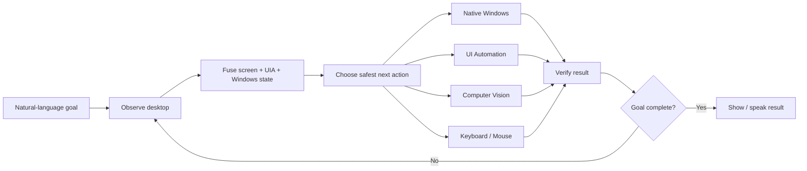

# SHAL Voice PC

> **AI voice control for Windows with computer vision, Windows UI Automation, keyboard/mouse automation, and native system control from an Android phone.**

SHAL Voice PC is an experimental **Windows voice assistant, multimodal desktop automation system, and computer-use agent** for controlling a real Windows PC from natural-language voice commands on Android.

Instead of depending on a fixed macro list, the project is being built around an **observe → understand → act → verify → recover** loop. The agent combines screenshot vision, Windows accessibility information, keyboard/mouse input, and native system actions to choose how to operate the desktop.

## Table of contents

- [Why SHAL Voice PC?](#why-shal-voice-pc)
- [Four control layers](#four-control-layers)
- [How the agent works](#how-the-agent-works)
- [Features](#features)
- [Vision-based screen control](#vision-based-screen-control)
- [Windows UI Automation](#windows-ui-automation)
- [Android controller](#android-controller)
- [Security model](#security-model)
- [Documentation](#documentation)
- [Roadmap](#roadmap)
- [Use cases](#use-cases)
- [Contributing](#contributing)
- [Project status](#project-status)

## Why SHAL Voice PC?

Most desktop voice assistants are limited to fixed phrases such as “open Chrome” or “turn the volume down.” SHAL Voice PC is designed for broader computer-use goals such as:

> “Open Chrome, go to Gmail, open the newest email from John, summarize it, then go back and open Downloads.”

The intended behavior is to inspect the desktop after meaningful steps, determine what changed, select the safest available control method, and continue instead of blindly replaying a fixed macro.

## Four control layers

| Layer | What it does |
|---|---|
| **Windows UI Automation** | Controls accessible buttons, fields, menus, tabs, lists, toggles, and other standard Windows controls |
| **Vision-based screen control** | Understands visible UI and clicks by screen location when accessibility metadata is missing |
| **Keyboard / mouse automation** | Provides a broad fallback for ordinary desktop interaction |
| **Native Windows / system control** | Handles files, processes, services, audio, networking, power, and other OS-level operations |

## How the agent works

The preferred action order is:

1. native typed action
2. application-specific adapter
3. Windows UI Automation
4. keyboard shortcut
5. vision-guided pointer action
6. coordinate fallback

## Features

- Natural-language Windows voice commands
- Android remote controller built with Flutter
- FastAPI Windows backend
- Windows UI Automation
- Computer-vision screen understanding
- Vision-guided click / double-click / right-click
- Visual-state waiting and verification
- Keyboard and mouse control
- Window and application control
- File Explorer automation
- Media controls
- Power controls with confirmation
- Live low-bandwidth PC screen on Android
- Touch-to-pointer control
- Piper text-to-speech
- Tailscale private networking
- Confirmation gates for consequential operations
- RustDesk and OpenSSH as independent recovery paths
- Semantic planning through a local model-routing layer
- Ongoing work toward autonomous multi-step desktop control

## Vision-based screen control

The vision layer is designed for cases where Windows accessibility information is incomplete or unavailable.

It can:

- capture the active window or full desktop
- inspect screenshot pixels
- locate a visually described target
- return normalized target coordinates and confidence
- correlate visual targets with UI Automation bounds when available
- click, double-click, or right-click detected targets
- wait for a requested visual state
- verify that the screen changed after an action

This is important for custom-rendered applications where ordinary accessibility automation does not expose every visible control.

## Windows UI Automation

The structured UIA layer supports:

- Button invocation
- Edit/Text field input
- CheckBox and toggle state
- ComboBox and List selection
- MenuItem activation
- Tab and ListItem selection
- Focus
- Expand / collapse
- Control-state reading
- Element bounds for screen correlation

## Android controller

The Flutter mobile app is designed to provide:

- voice input
- assistant status
- spoken responses
- live PC screen
- tap / double-tap / right-click interactions
- confirmations for consequential operations
- task interruption
- manual fallback control

## Security model

SHAL Voice PC controls a real computer, so safety is part of the architecture.

- The planner is intended to select from **typed, allowlisted actions**.
- It is **not intentionally given unrestricted model-generated shell access**.
- Consequential operations can require explicit user confirmation.
- The backend is intended to run over a **private Tailscale network**, not direct public Internet exposure.
- Credentials, pairing material, local databases, logs, signing keys, and private runtime data should remain outside source control.

Read the [Security Policy](SECURITY.md).

## Documentation

- [Architecture](docs/ARCHITECTURE.md)
- [Getting Started](docs/GETTING-STARTED.md)
- [Public Roadmap](docs/ROADMAP.md)
- [Project Status](docs/PROJECT-STATUS.md)
- [Support](SUPPORT.md)
- [Contributing](CONTRIBUTING.md)
- [Changelog](CHANGELOG.md)

## Roadmap

Current areas of work include:

- persistent autonomous observe / act / verify orchestration
- richer visual reasoning and target tracking
- browser / DOM-aware control
- typed file-system operations
- clipboard state
- native Windows settings adapters
- interruption and cancellation
- long-running task monitoring
- reliability across different Windows applications
- safer recovery and verification behavior
- public installer / updater and release packaging

See the full [Public Roadmap](docs/ROADMAP.md).

## Use cases

SHAL Voice PC is relevant to developers, researchers, and advanced users interested in:

- Windows voice control
- AI desktop automation
- computer-use agents
- multimodal AI assistants
- computer vision GUI automation
- Windows UI Automation
- Android-to-PC remote control
- local AI assistants
- hands-free computer control
- accessibility automation
- remote Windows automation
- visual desktop agents

## Contributing

Bug reports, reproducible test cases, documentation fixes, Windows compatibility improvements, UI Automation fixes, computer-vision improvements, Flutter UX work, and safety improvements are welcome.

See [CONTRIBUTING.md](CONTRIBUTING.md).

If this project is useful or interesting to you, consider **starring the repository** and watching releases.

## Downloads and releases

Generated APKs should be distributed through **GitHub Releases**, not committed directly to the source tree.

A tag-driven Android release workflow is included so version tags can build the Flutter APK and attach it to a GitHub Release after the complete public source tree is available.

## Project status

**Active development — v0.4.0.** The complete source code for both the Windows backend (`PC-Backend/`) and the Android mobile controller (`Mobile-App-Flutter/`) is available in this repository.

See [Project Status](docs/PROJECT-STATUS.md).

## Search terms

Windows voice control, AI desktop automation, AI computer-use agent, computer vision GUI automation, Windows UI Automation, Android PC remote control, multimodal desktop assistant, hands-free Windows control, local AI assistant, FastAPI desktop automation, Flutter remote control, Tailscale remote desktop, AI screen control, visual desktop automation.

## License

This project is licensed under the [MIT License](LICENSE).
