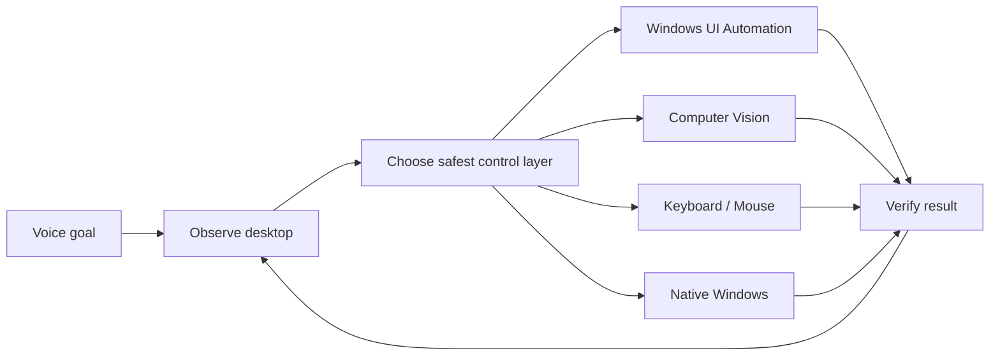

# SHAL Voice PC

AI voice control for Windows with computer vision, Windows UI Automation, keyboard and mouse automation, and native system control from an Android phone.

SHAL Voice PC is an experimental Windows desktop automation project focused on natural-language computer control, multimodal screen understanding, and an observe → act → verify control loop.

## Core capabilities

- Windows UI Automation
- Vision-based screen control
- Keyboard and mouse automation
- Native Windows system actions
- Android Flutter controller
- FastAPI backend
- Tailscale private networking
- Piper text-to-speech
- Confirmation gates for consequential actions

## Target workflow

> “Open Chrome, go to Gmail, open the newest email from John, summarize it, then go back and open Downloads.”

The system is being designed to inspect the desktop after each meaningful step and choose the safest available control method instead of relying on fixed macros.

## Architecture

## Keywords

Windows voice control, AI desktop automation, computer vision GUI automation, Windows UI Automation, Android PC remote control, multimodal AI assistant, computer-use agent, hands-free Windows control, Flutter remote control, FastAPI automation, Tailscale remote desktop.
