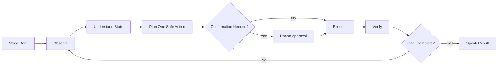

# SHAL Universal Voice PC Control System

> [!abstract] Purpose
> Master index and handoff for the current SHAL Voice PC system before the fully universal-control phase.

## Quick Links
- [[01.01 - System Overview and Current Status|Current System Overview]]
- [[01.02 - Current Capabilities Limitations and Safety|Capabilities, Limits and Safety]]
- [[02.01 - System Architecture Diagrams|Architecture Diagrams]]
- [[03.01 - Voice Command Catalog and Natural Language Examples|Voice Command Catalog]]
- [[03.02 - Action Allowlist Control Matrix and Risk Levels|Action Matrix and Risk Levels]]
- [[04.01 - Components Paths Services and Configuration|Components, Paths and Services]]
- [[04.02 - Network Remote Access and Mobile Architecture|Network and Remote Access]]
- [[05.01 - Setup Build Deployment and Recovery Runbook|Setup and Recovery Runbook]]
- [[06.01 - Development History Known Issues and Lessons Learned|History and Known Issues]]
- [[07.01 - Fully Universal Control Target Architecture and Implementation Plan|Universal Control Roadmap]]
- [[07.02 - Universal Control Acceptance Criteria and Test Matrix|Universal Acceptance Tests]]

## Vault Structure
```text
SHAL Universal Voice PC Control System/
├─ 00.01 - Documentation Index and Handoff.md
├─ 01 - Overview and Current State/
├─ 02 - System Architecture and Diagrams/
├─ 03 - Voice Commands and Control Matrix/
├─ 04 - Components Configuration and Paths/
├─ 05 - Operations Setup and Recovery/
├─ 06 - History Known Issues and Constraints/
└─ 07 - Universal Control Roadmap/
```

## Current Snapshot
| Area | Current state |
|---|---|
| PC | SHAL / Windows 11 Pro / ROC STORE |
| Motherboard | MSI PRO B760M-E |
| RAM | 16 GB |
| Phone | POCO C65 |
| Mobile controller | SHAL Voice PC v0.2.2 |
| Private transport | Tailscale |
| GUI recovery | RustDesk |
| CLI recovery | OpenSSH + ConnectBot |
| ChatGPT maintenance bridge | Remote Desktop Commander |
| Voice backend | FastAPI on private Tailscale TCP 8765 |
| Planner | OmniRoute |
| TTS | Piper `en_US-lessac-high` |
| Desktop control | UI Automation + keyboard + mouse + screenshots |
| Risk handling | Confirmation-gated consequential actions |

## Universal Control Loop


> [!important] Control philosophy
> Do not expand this system by adding hundreds of one-off voice phrases. Build a stateful observe → understand → act → verify → recover loop.

## Next Development Start Point
Start with [[07.01 - Fully Universal Control Target Architecture and Implementation Plan]] and use [[07.02 - Universal Control Acceptance Criteria and Test Matrix]] as the completion standard.

> [!warning] Secrets
> Do not store pairing keys, RustDesk passwords, provider API keys, SSH private keys, tokens, browser credentials, or other secrets in this vault.
