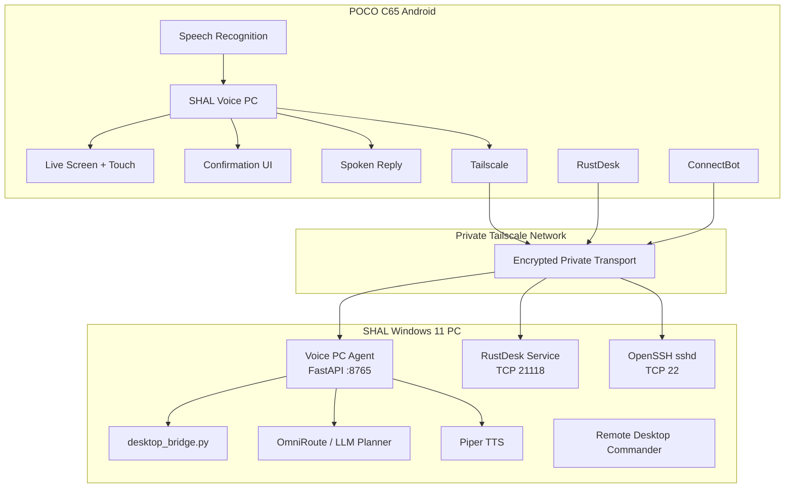
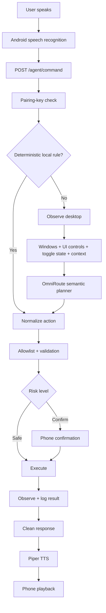
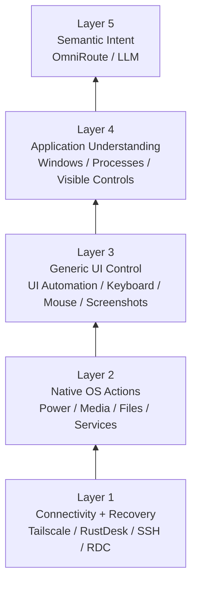
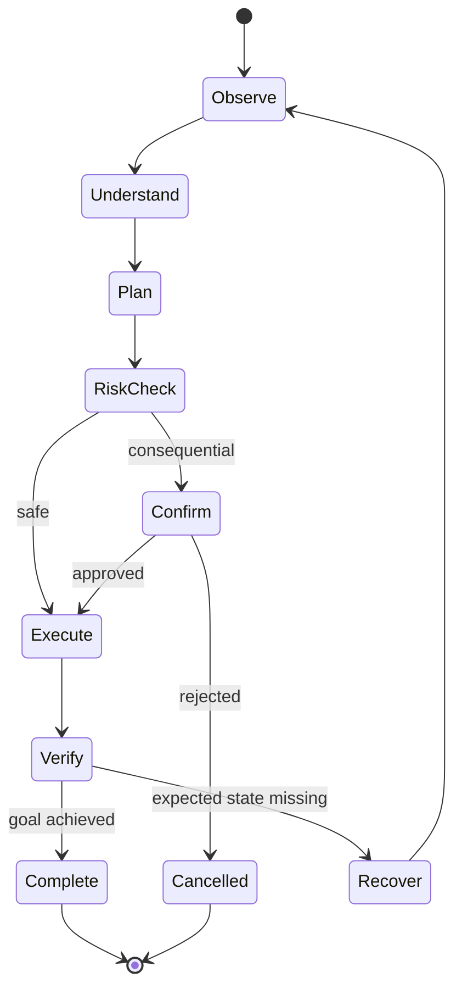
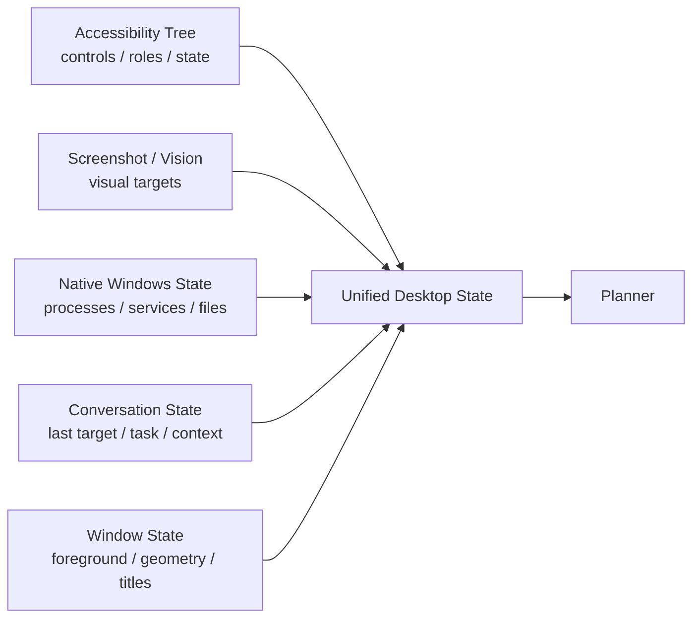
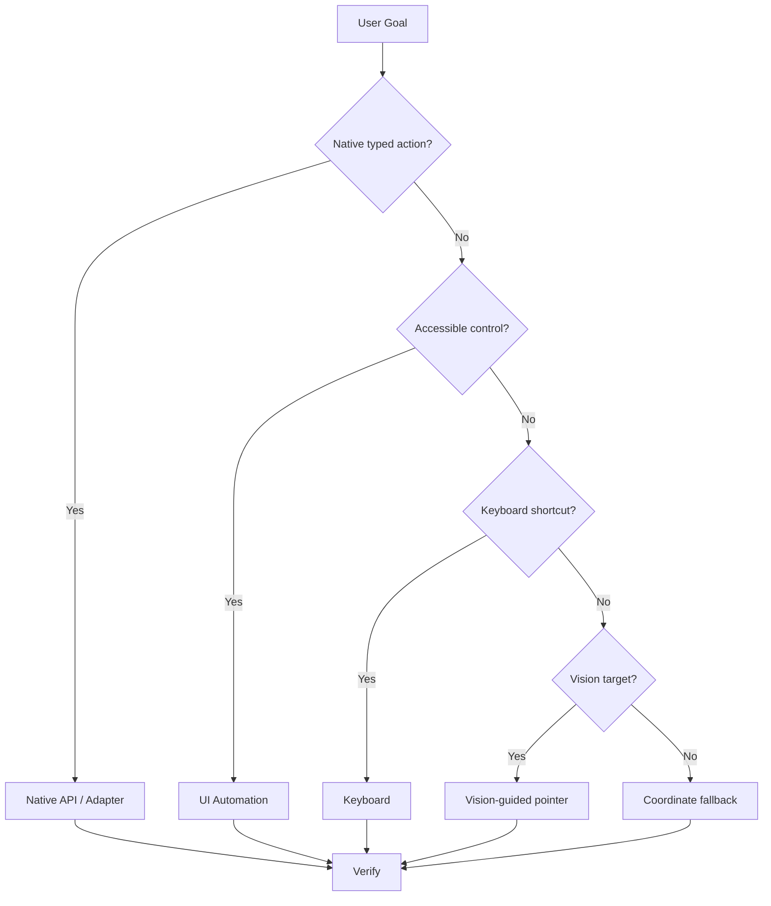
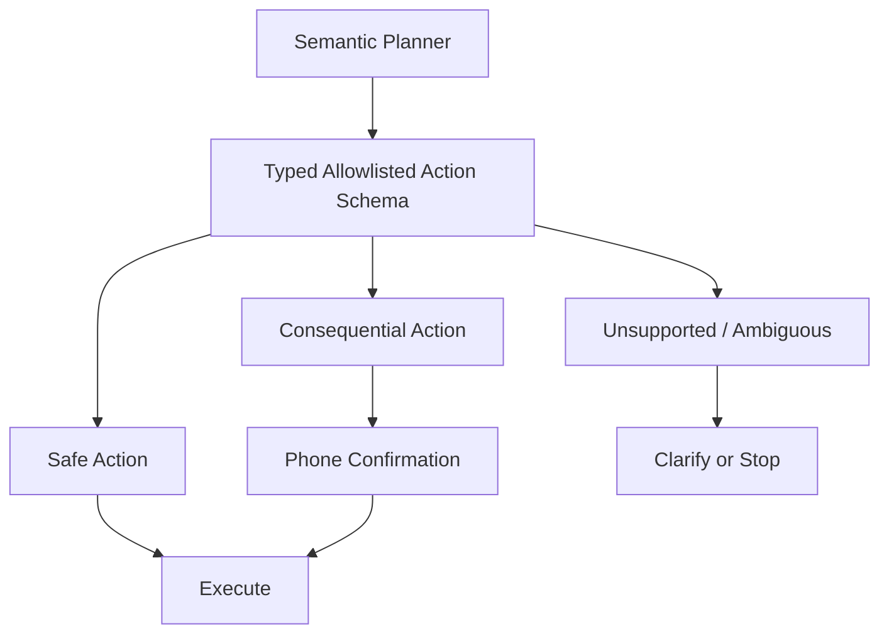
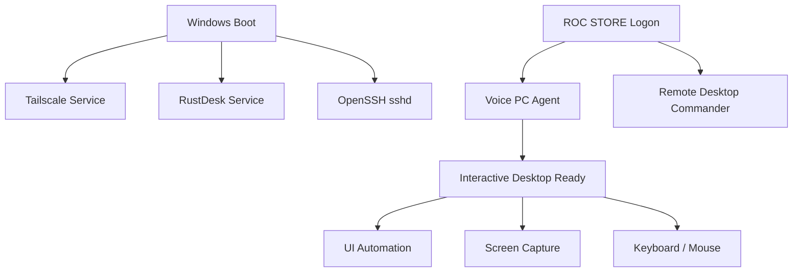
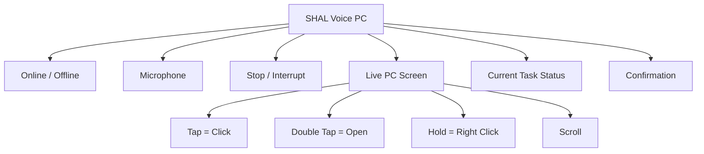
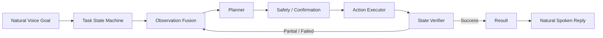

# System Architecture Diagrams

[[00.01 - Documentation Index and Handoff|← Documentation Index]] · [[07.01 - Fully Universal Control Target Architecture and Implementation Plan|Universal Roadmap →]]

> [!info]
> These are native **Mermaid** diagrams. Obsidian renders them directly in Reading View and Live Preview.

## High-Level System

## Voice Command Flow

## Current Control Stack

## Universal Observe-Plan-Act-Verify Loop

## Observation Fusion

## Action Selection Priority

## Safety Boundary

## Startup Dependencies

## Mobile Experience

## Target Universal Architecture

## Related Notes
- [[01.01 - System Overview and Current Status]]
- [[03.02 - Action Allowlist Control Matrix and Risk Levels]]
- [[04.02 - Network Remote Access and Mobile Architecture]]
- [[07.01 - Fully Universal Control Target Architecture and Implementation Plan]]
