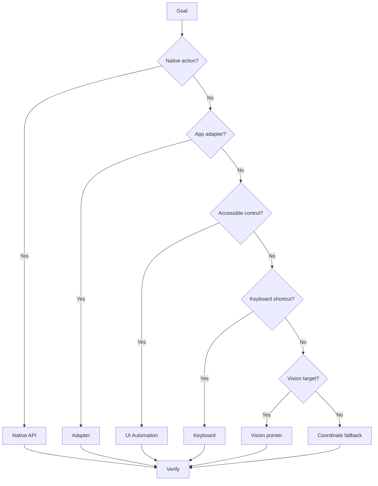

# Action Allowlist, Control Matrix and Risk Levels

[[00.01 - Documentation Index and Handoff|← Documentation Index]]

## Action Families
### Observation
- `status`
- `read_active`
- `summarize_active`
- `summarize_target`
- `list_windows`
- screen capture / UI snapshot

### Applications
- `open_app`
- `open_start_app`
- `focus_app`
- `focus_window`
- `app_window`
- `named_window_action`

### Visible UI
- `ui_invoke`
- `ui_set_toggle`
- `ui_set_text`

### Windows
- maximize / minimize / restore / close
- left / right
- next / previous
- restore_all

### Files / Explorer
- `open_this_pc`
- `open_drive`
- `open_known_location`
- `explorer_action`
- `explorer_rename`
- `explorer_new_folder`

### Keyboard
- enter / escape / tab / shift_tab
- select_all / copy / cut / paste
- undo / redo / save
- delete / rename / refresh
- new_folder / back / forward / find
- new_tab / close_tab / reopen_tab
- open_explorer / open_settings
- lock / show_desktop / task_view / run_dialog
- home / end / page_up / page_down / space
- `type_text`

### Pointer / Media / Power
- `scroll`
- `mouse_voice`
- `media_key`
- `lock_pc`
- `sleep_pc`
- `set_sleep_timeout`
- `restart_pc`
- `shutdown_pc`

### AI Handoff
- `prompt_app`
- `send_active_summary`
- `send_last_context`

### Sequence
- `desktop_sequence`

## Risk Matrix
| Action class | Default |
|---|---|
| Read/status | Safe |
| Focus/switch | Safe |
| Maximize/minimize/restore | Safe |
| App launch | Safe |
| Navigation | Safe |
| Scroll/media | Safe |
| Harmless UI invoke | Safe |
| Close | Confirm |
| Delete | Confirm |
| Paste/move | Confirm |
| External submission | Confirm |
| AI handoff | Confirm |
| Sleep/restart/shutdown | Confirm |
| Sensitive admin tools | Confirm |

## State-Aware Toggles
For "turn X on/off" or "enable/disable X":
1. read current state
2. compare target state
3. do nothing if already correct
4. toggle only when required
5. verify final state

## Control Priority

> [!danger]
> The planner must not invent arbitrary PowerShell, CMD or executable paths.

## Planned Universal Actions
- `vision_click`
- `vision_drag`
- `wait_for_screen_state`
- `find_visual_target`
- `inspect_active_application`
- typed clipboard/file/process/service/network/browser actions
