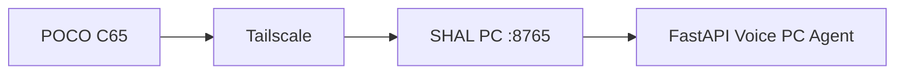
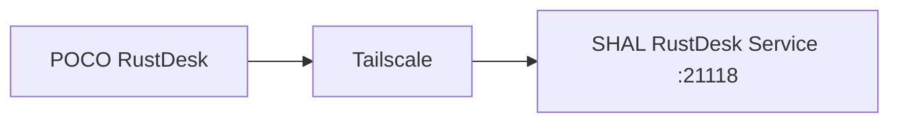
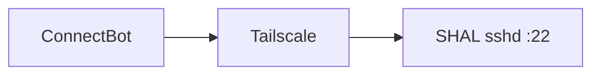
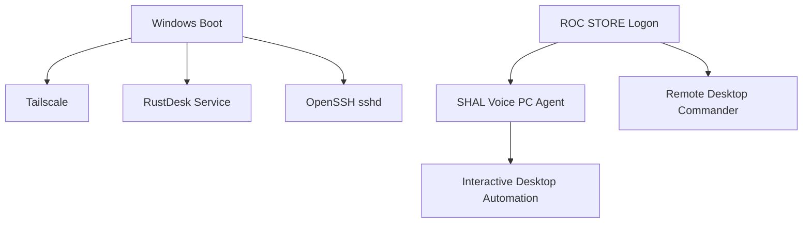
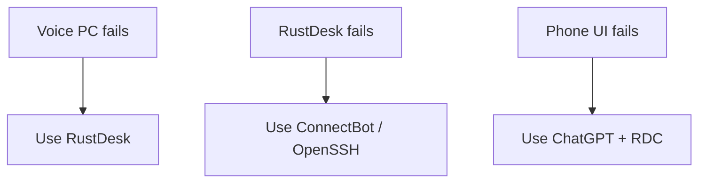

# Network, Remote Access and Mobile Architecture

[[00.01 - Documentation Index and Handoff|← Documentation Index]] · [[02.01 - System Architecture Diagrams|Architecture →]]

## Design Objective
Remote control must remain private, recoverable and independent across multiple access paths.

## Voice PC Path

Phone app stores:
- server address
- pairing key in secure storage
- local settings

Reconnect logic:
1. stored server
2. `http://shal:8765`
3. last known Tailscale fallback
4. periodic retry

> [!todo]
> Replace historical-IP fallback with identity-based Tailscale discovery.

## RustDesk

POCO stability settings:
- Battery: No restrictions
- Autostart ON
- background activity allowed
- floating-window permission
- lock in Recents if available

## OpenSSH / ConnectBot

Purpose: emergency CLI access independent of the main voice UI.

## Remote Desktop Commander
Purpose:
- ChatGPT-side filesystem access
- terminal
- process inspection
- edits
- diagnostics

## Startup Timeline

## Mobile App Roles
- microphone
- assistant status
- natural speech
- Stop/Interrupt
- live PC screen
- confirmation
- touch fallback
- task progress
- manual pointer mode

## Live Screen
Current:
- JPEG captures
- periodic refresh
- lower frame rate than RustDesk
- touch pointer actions

Future:
- adaptive refresh
- dirty-region updates
- optional WebRTC/H.264
- vision overlay
- current action highlight
- pointer feedback

## Security
Voice API should:
- remain private on Tailscale
- require pairing key
- avoid public binding
- avoid arbitrary shell exposure

## Recovery Principle

> [!danger]
> Never intentionally remove every remote recovery path during remote maintenance.
