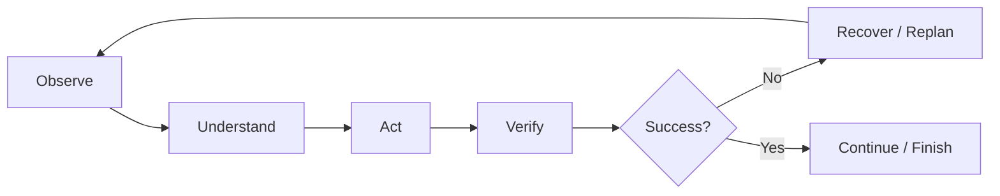

# Development History, Known Issues and Lessons Learned

[[00.01 - Documentation Index and Handoff|← Documentation Index]] · [[07.01 - Fully Universal Control Target Architecture and Implementation Plan|Next Phase →]]

## Original Goal
A mobile voice interface for important PC functions without depending on ChatGPT for every action.

It evolved into:
- independent mobile app
- natural voice
- live screen
- semantic reading/summarization
- remote recovery
- universal PC control

## CLI Rejected as Primary UX
ConnectBot remains emergency CLI. Primary UX must be visual and app-like.

## Web Interface Rejected as Primary UX
Primary UX is Flutter Android, not browser-first.

## Early Voice Limitations
Problems:
- robotic speech
- literal punctuation
- no stop control
- fixed quick actions

Changes:
- Piper TTS
- `en_US-lessac-high`
- speech cleanup
- Stop Voice
- Android fallback

## Antigravity Targeting Bug
Problems:
- wrong handoff behavior
- app launch instead of reading
- "anti gravity" alias confusion

Changes:
- target-specific response summarization
- desktop process mapping
- alias normalization
- reading vs handoff distinction

## Codex Targeting Bug
Problem:
- Codex CLI confused with desired GUI workflow

Changes:
- GUI target maps to ChatGPT/Codex desktop app
- CLI is not default GUI target

## Phone Offline Problem
Root cause:
- POCO Tailscale went offline/background-idle

Changes:
- background allowances
- Doze whitelist
- reconnect logic
- server rediscovery
- phone Tailscale reporting

> [!lesson]
> Offline status must distinguish backend, network, Tailscale and authentication failures.

## POCO Permission Issue
MIUI/HyperOS can reject ADB runtime permission grants.

Changes:
- script no longer aborts
- App Info fallback
- continue background setup
- report actual state

## RustDesk Background Disconnect
Evidence:
- Windows service remained running
- disconnect originated peer/client side

Changes:
- prefer direct Tailscale RustDesk
- POCO No restrictions / Autostart
- direct-path helper

## Fixed-Command Problem
Requirement:
> Control the whole PC naturally.

Changes:
- generic window discovery
- Start-menu launch
- accessibility snapshot
- semantic planner receives UI state
- visible-control invocation
- state-aware toggles
- text-field control
- mouse fallback
- multi-step sequences

## Universal-Control Gap
Still missing:
- persistent agent loop
- primary vision fallback
- full action verification
- robust replanning after UI changes

## Package-Management Lesson
Use pnpm shared store, not manual shared `node_modules`.

## Remote-Access Lesson
> [!danger]
> Never replace the only working remote path before the replacement is verified.

## Administrative Boundary
User-session automation cannot reliably control:
- UAC Secure Desktop
- BIOS/UEFI
- pre-login graphical desktop

## Current Known Limitations
- lower frame rate than RustDesk
- incomplete visual reasoning
- custom UI accessibility gaps
- Android speech-recognition dependency
- POCO background restrictions
- historical IP fallback
- brittle preplanned sequences

## Next Lesson

