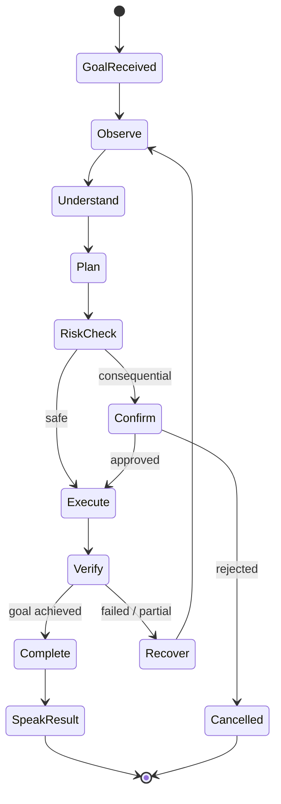
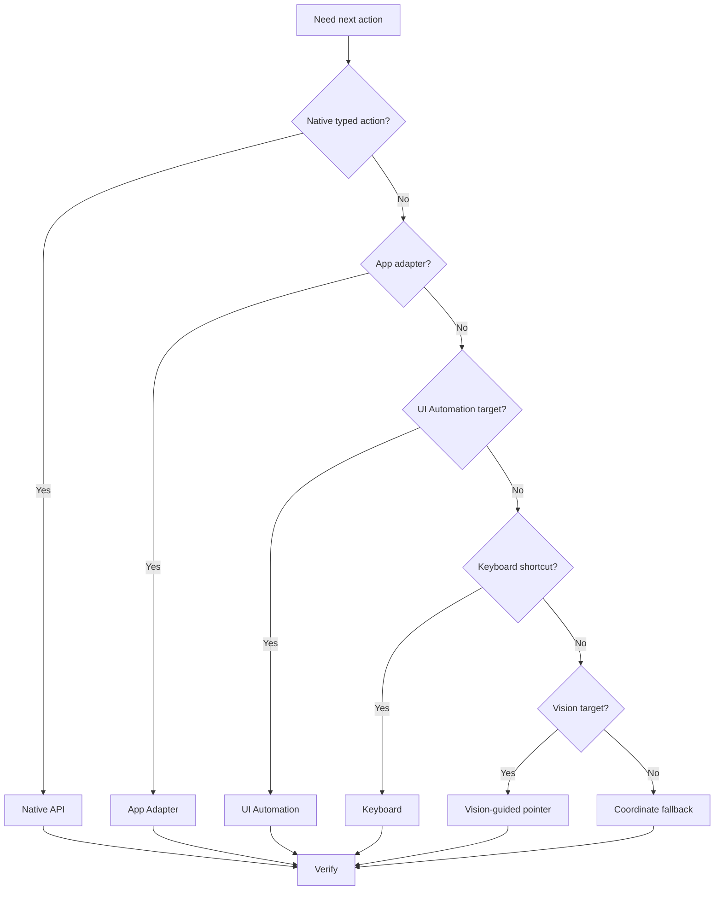
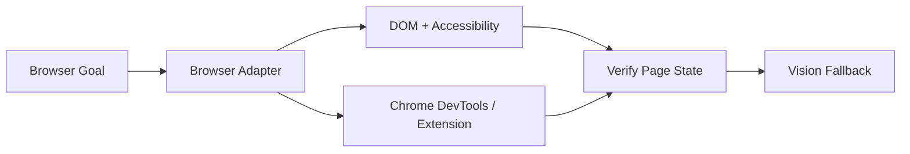

# Fully Universal Control Target Architecture and Implementation Plan

[[00.01 - Documentation Index and Handoff|← Documentation Index]] · [[07.02 - Universal Control Acceptance Criteria and Test Matrix|Acceptance Tests →]]

> [!goal]
> Move from broad command-based control to goal-based universal desktop operation.

## Target User Experience
The user speaks a goal. The agent:
1. observes
2. understands
3. chooses the next safe action
4. executes
5. verifies
6. re-plans if needed
7. continues until done, blocked, cancelled or awaiting confirmation

## Core Architecture

## Universal Observation Layer
### Accessibility
- process
- active window
- names
- roles
- enabled state
- toggle state
- selection state
- bounds

### Screen / Vision
- screenshot
- visual target detection
- icons/text/dialogs
- custom canvases

### Native Windows State
- processes
- services
- files
- clipboard
- network
- window geometry
- audio/media
- power

### Task Memory
- goal
- subgoal
- previous action
- expected result
- observation
- retries
- confirmation state

## Action Selection

## Vision Layer
- [ ] active window/monitor capture
- [ ] image optimization
- [ ] vision model integration
- [ ] element schema: type / label / bounds / confidence / state
- [ ] accessibility correlation
- [ ] `vision_click`
- [ ] `vision_double_click`
- [ ] `vision_right_click`
- [ ] `vision_drag`
- [ ] `wait_for_visual_state`

## Verification
Every action must define expected state.

Examples:
- open Calculator → window exists and foreground
- click Bluetooth & devices → Settings page changes
- turn Bluetooth off → toggle reads Off
- copy file → clipboard/Explorer confirms copy

If missing:
1. re-observe
2. retry structured method
3. alternate method
4. stop with concrete blocker

## Retry Policy
- [ ] attempt 1: preferred structured method
- [ ] attempt 2: re-observe and retry
- [ ] attempt 3: alternate method
- [ ] never blindly repeat destructive action

## App Adapters
- [ ] File Explorer
- [ ] Chrome/browser
- [ ] Windows Settings
- [ ] ChatGPT/Codex
- [ ] Antigravity
- [ ] Obsidian
- [ ] Visual Control Center
- [ ] development tools

## Browser Control

Planned:
- [ ] tab discovery
- [ ] URL/title state
- [ ] DOM accessibility
- [ ] text entry
- [ ] click by DOM/accessibility
- [ ] screenshot fallback

## File System Control
- [ ] find file
- [ ] find newest file
- [ ] list folder
- [ ] copy
- [ ] move
- [ ] rename
- [ ] create folder
- [ ] Recycle Bin delete
- [ ] metadata
- [ ] open with application

## Clipboard
- [ ] read/write
- [ ] file-list detection
- [ ] preserve/restore
- [ ] redact sensitive logs

## Process and App Control
- [ ] inspect
- [ ] launch
- [ ] focus
- [ ] graceful close
- [ ] force terminate with confirmation
- [ ] wait for process/window
- [ ] hung-state detection

## Windows System Adapters
- [ ] audio devices
- [ ] brightness/display
- [ ] Bluetooth
- [ ] Wi-Fi
- [ ] notifications
- [ ] default apps
- [ ] power plans
- [ ] printers
- [ ] storage
- [ ] Windows Update read-only status
- [ ] services

## Mobile UX
- [ ] one large microphone
- [ ] Stop/Interrupt
- [ ] live PC screen
- [ ] current task
- [ ] cancel task
- [ ] state labels
- [ ] manual pointer mode

## Interruption
Must understand:
- stop
- cancel
- wait
- pause
- go back
- don't do that
- continue

Global cancellation stops speech, action loop, waits and queued steps.

## Observability
Log:
- task ID
- original goal
- observation summary
- selected action
- result
- verification
- retries
- confirmation
- final status

## Safety
Never allow:
- authentication bypass
- Secure Desktop bypass
- permanent delete without approval
- disk formatting
- casual partition changes
- disabling all recovery
- arbitrary model-generated shell
- secret exposure

## Implementation Phases
### Phase 1 — Agent Loop
- [ ] task state machine
- [ ] observe/action/verify
- [ ] cancellation
- [ ] retries

### Phase 2 — Vision
- [ ] screenshot optimization
- [ ] vision integration
- [ ] visual element schema
- [ ] pointer fallback

### Phase 3 — Generic UI
- [x] stronger element identity — label, AutomationId, ControlType and window targeting
- [x] bounds — UI snapshot includes element rectangles for screen correlation
- [x] selection/value/toggle state — targeted controls return Value/State and toggles are state-verified
- [x] dropdown/menu navigation — ComboBox selection plus MenuItem/Button/Tab/List invocation

> [!success] Windows UI Automation layer completed — 2026-09-29
> Implemented a shared typed UIA controller for normal Windows **buttons, text fields, menus, lists/ComboBoxes, checkboxes/toggles, focus, expand/collapse and read-state operations**. The semantic/universal planner can call it through the allowlisted `ui_control` action. A WPF self-test passed for Edit `set_text`, CheckBox `toggle`, ComboBox `select`, MenuItem `invoke`, Button `invoke`, and Python compilation of both backend modules.

### Phase 4 — Browser
- [ ] Chrome adapter
- [ ] extension/CDP

### Phase 5 — Files
- [ ] typed search/copy/move/delete
- [ ] verification

### Phase 6 — System
- [ ] audio/network/Bluetooth/services/settings

### Phase 7 — Mobile UX
- [ ] task status
- [ ] cancellation
- [ ] richer live screen
- [ ] action overlay

### Phase 8 — Reliability
- [ ] recovery
- [ ] stale-window handling
- [ ] timing adaptation
- [ ] app-specific quirks
- [ ] long-running monitoring

> [!quote]
> Completion means the user describes the desired result and the agent determines how to operate the PC to achieve it.
