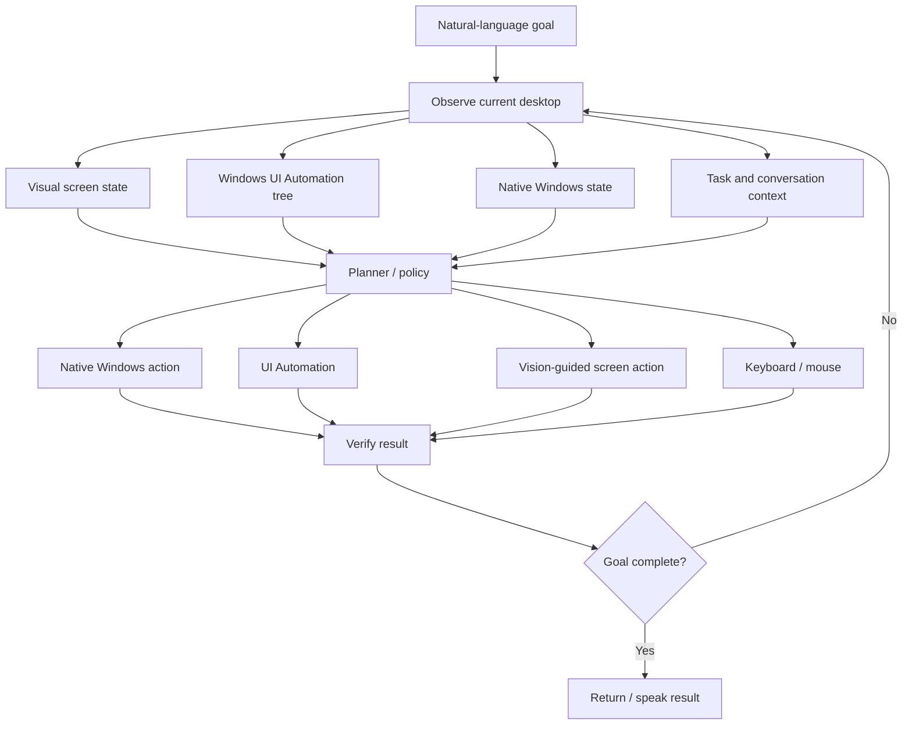

# Architecture

SHAL Voice PC is designed as a multimodal Windows computer-use agent.

## Control stack

## Layer 1 — Windows UI Automation

Used for structured Windows controls when available:

- buttons
- text/edit fields
- menu items
- tabs
- lists
- combo boxes
- checkboxes and toggles
- focus
- expand/collapse
- control-state reading
- element bounds

## Layer 2 — Vision-based screen control

Used when controls are visually present but missing or incomplete in accessibility metadata.

The vision layer can:

- capture the active window or desktop
- locate a target from screenshot pixels
- estimate target bounds and confidence
- correlate the target with accessibility bounds when possible
- click, double-click, or right-click a detected target
- wait for a visible state
- verify screen change after an action

## Layer 3 — Keyboard and mouse automation

General desktop fallback:

- keyboard shortcuts
- text entry
- pointer movement
- click / double-click / right-click
- scrolling
- drag operations

## Layer 4 — Native Windows / system control

Preferred when a typed OS operation is more reliable than GUI manipulation:

- application launch and focus
- windows
- files and folders
- processes
- services
- media
- power
- networking and other system functions

## Safety boundary

The planner should select typed, allowlisted actions. Consequential actions can require explicit confirmation.

The project does not aim to bypass Windows authentication, UAC Secure Desktop, BIOS/UEFI security, CAPTCHA systems, or third-party anti-automation protections.
